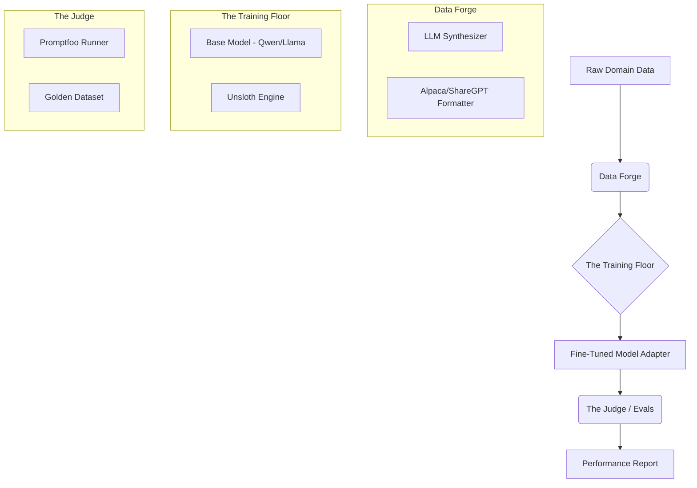

# Product Requirements Document: OpenSSME (v0.1)
# NOTE: OpenSSME is a Python-only project for now. All orchestration, automation, and tooling should be implemented in Python. Any references to Node.js or JS tools are for future consideration and should not be implemented at this stage.

| **Project Name** | OpenSSME (Open Source Small Model Expert) |
| :--- | :--- |
| **Version** | 0.1 (MVP) |
| **Status** | Draft |
| **Target Hardware** | Local (RTX 4090 24GB) & Cloud Spot Instances |
| **Core Philosophy** | "Data is the programming language; the model is the compiler." |

## 1. Executive Summary
OpenSSME is a modular, local-first "factory" pipeline designed to create high-performance, domain-specific Small Language Models (SLMs) (<8B parameters). Unlike general fine-tuning scripts, OpenSSME treats model creation as a software engineering lifecycle: **Data Engineering → Baseline Eval → Training → Regression Testing.**

The goal of v0.1 is to establish a functional end-to-end loop that allows a user to take raw text data and produce a fine-tuned, evaluated model using an RTX 4090.

## 2. System Architecture

The system consists of three distinct engines tied together by a central configuration controller.



## 3. Functional Requirements

### 3.1. Module A: The Data Forge

Responsibility: Turn raw documents into high-quality training pairs.

**Architecture: Strategy Pattern**
To support extensibility for different data types (Text, Image, Time-series), the Data Forge will use a Strategy Pattern.
- **BaseForge (Interface):** Defines the contract (`load`, `synthesize`, `format`).
- **TextForge (Default):** Implements the standard text processing pipeline described below.
- **Custom Forge:** Users can extend `BaseForge` and specify their class in the config.

- FR-A1 (Ingest): System must accept raw text (.txt, .md) from a data/raw directory.

- FR-A2 (Synthesize): System must utilize an external API (OpenAI/Anthropic) to generate Instruction -> Output pairs based on the raw text.

    - Constraint: Must allow configuration of "Teacher Model" (e.g., GPT-4o-mini for cost, GPT-4o for quality).

- FR-A3 (Format): Output must be saved in JSONL format compatible with Axolotl/Unsloth (ShareGPT format preferred).

- FR-A4 (Split): Automatically split data into train.jsonl (90%) and test.jsonl (10%).

### 3.2. Module B: The Training Floor

**Responsibility: Efficiently adapt model weights.**

- FR-B1 (Engine): Must leverage Unsloth for 2x faster training and memory reduction.

- FR-B2 (Config): Training parameters (learning rate, rank, epochs) must be defined in a single YAML file, not hardcoded in Python.

- FR-B3 (Local/Cloud Parity): The training script must detect hardware.

    - Local: Use strictly enforced VRAM limits (max 22GB for 4090 safety).

    - Cloud: Allow full utilization of A100/H100 if detected.

- FR-B4 (Output): Must save LoRA adapters to models/adapters/{run_name}.

### 3.3. Module C: The Judge (Evaluation)

**Responsibility: Objective measurement of quality.**

- FR-C1 (Framework): Integration with Promptfoo for regression testing.

- FR-C2 (Golden Set): Support for a manual evals/golden_set.json file containing ground-truth Q&A.

- FR-C3 (LLM-as-a-Judge): Capability to use a "Judge" model to score the fine-tuned model's answer against the Golden Answer on a 1-5 scale.

- FR-C4 (Reporting): Output a CLI summary table: Baseline Score vs Fine-Tuned Score.

## 4. Technical Stack & Implementation Guide

### 4.1. Directory Structure

opensem/

#### Multi-SEM Project Separation

To support the creation and management of multiple Small Expert Models (SEMs) within the same OpenSEM instance, each SEM project should have its own subdirectory under the main folders (`data`, `models`, `configs`, etc.). This keeps data, configs, and model outputs isolated, while core scripts are reused across projects.


**Example structure for multiple SEMs:**

```Plaintext
opensem/
├── configs/
│   ├── sem1/
│   │   ├── train_config.yaml
│   │   └── eval_config.yaml
│   ├── sem2/
│   │   ├── train_config.yaml
│   │   └── eval_config.yaml
├── data/
│   ├── sem1/
│   │   ├── raw/
│   │   ├── processed/
│   │   └── golden/
│   ├── sem2/
│   │   ├── raw/
│   │   ├── processed/
│   │   └── golden/
├── models/
│   ├── sem1/
│   │   ├── base/
│   │   └── adapters/
│   ├── sem2/
│   │   ├── base/
│   │   └── adapters/
├── scripts/           # Utility scripts for setup, automation, etc.
├── src/
│   ├── forge.py
│   ├── train.py
│   └── judge.py
└── requirements.txt
```

**CLI Application:**
- A CLI app (`opensem-cli`) will be available from the project root to automate common tasks such as creating new SEM projects, running data forge, training, and evaluation. This improves usability and reproducibility.

**Notes:**
- Each SEM (e.g., `sem1`, `sem2`) has its own data, configs, and model outputs.
- Core scripts in `src/` are reused, but take project-specific paths/configs as input.
- Utility scripts in `scripts/` can automate setup and maintenance.
- The CLI app orchestrates workflows and project management from the root.

**Notes:**
- Each SEM (e.g., `sem1`, `sem2`) has its own data, configs, and model outputs.
- Core scripts in `src/` are reused, but take project-specific paths/configs as input.
- This structure keeps projects isolated, supports parallel development, and makes it easy to add new SEMs.

### 4.2. Selected Technologies

- Orchestration: Python 3.10+

- Training Core: Unsloth (optimized bitsandbytes + triton).

- Config Management: yaml (compatible with Axolotl standards).

- Evaluation: Promptfoo (prefer Python-native alternatives; Node.js integration deferred until future versions).

- Tracking: Weights & Biases (wandb).

- CLI & Automation: Python-based CLI app (`opensem-cli`) and utility scripts in `scripts/` for project setup, management, and workflow automation.

5. MVP Workflow (The "Happy Path")

1. Setup: User fills data/raw with domain documents.

2. Forge: User runs python src/forge.py. System generates data/processed/train.jsonl.

3. Baseline: User runs python src/judge.py --mode baseline. System records scores of the vanilla Llama-3.2-3B model.

4. Train: User runs python src/train.py. System fine-tunes Llama-3.2-3B on the 4090. Saves adapter.

5. Eval: User runs python src/judge.py --mode fine-tuned. System loads the adapter and re-runs the test.

6. Success: Console displays: "Accuracy improved by X%".

## 5. Future Scope (Post-MVP)

- CPT Pipeline: Add support for Continued Pre-Training on raw text before SFT.

- DPO Integration: Add a preference optimization step (ORPO) for alignment.

- Cloud Launcher: A CLI command opensem launch --cloud to spin up a Runpod instance and push the current state.